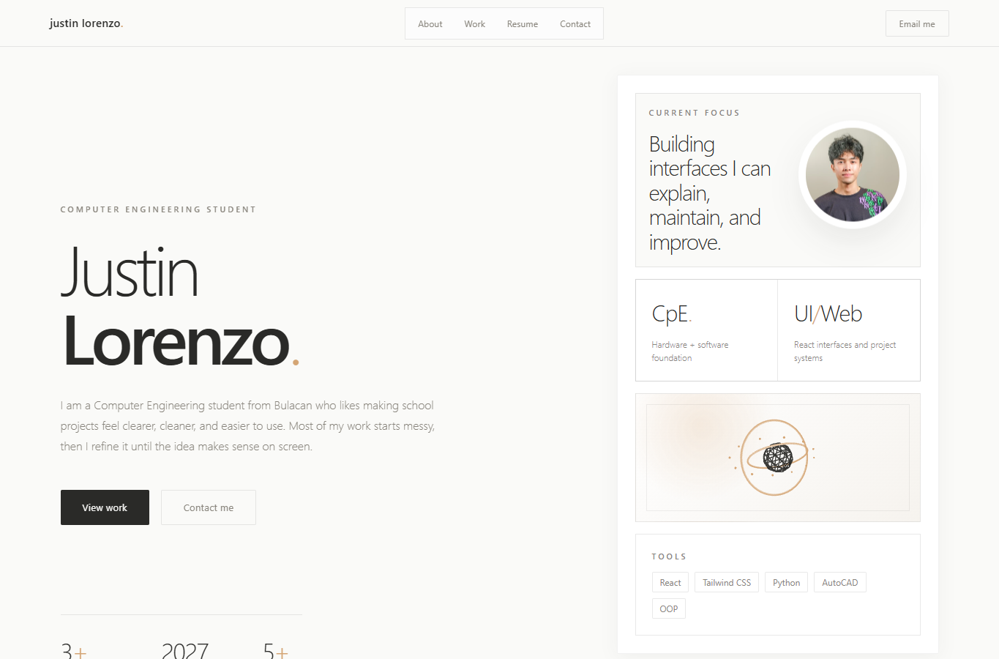

# Justin R. Lorenzo Portfolio

A refined personal portfolio for Justin R. Lorenzo, a Computer Engineering student focused on front-end development, practical student tools, and technical project presentation.

Live site: https://justinlorenzo.vercel.app



## Design Direction

This revision follows **Rams Quiet Tech**: warm paper (`#f4f2ec`), Swiss-calm IBM Plex Sans, ink/muted type, hairline borders, and a spare blue accent. Slice 1 covers tokens, the uppercase nav, the static home hero, and a scannable project strip. About, Resume, Notes, Contact, and Footer inherit tokens only and will be restyled in later slices.

## Tech Stack

- React
- Vite
- Tailwind CSS
- Vercel Serverless Functions
- Resend

## Pages

- Home: short professional introduction and quick highlights
- About: profile, focus areas, and tools
- Work: selected project cards with summaries and stacks
- Resume: education, experience, contributions, and skills
- Notes: short writing prompts for future blog entries
- Contact: direct links and backend-powered contact form

## Getting Started

```bash
npm install
npm run dev
```

## Production Build

```bash
npm run build
npm run preview
```

## Contact Form Environment

The contact form posts to `/api/contact` and sends email through Resend.

Set these variables in Vercel:

```bash
RESEND_API_KEY=your_resend_api_key
CONTACT_TO_EMAIL=johnjustinrl15@gmail.com
CONTACT_FROM_EMAIL=Portfolio <onboarding@resend.dev>
```

For production, replace `CONTACT_FROM_EMAIL` with a verified sender/domain in Resend.

## Suggested Next Updates

- Add live demo links for each project.
- Add individual GitHub repository links per project.
- Replace placeholder project screenshots with polished case-study images.
- Add a downloadable resume PDF if you want the resume button to link to a file.
